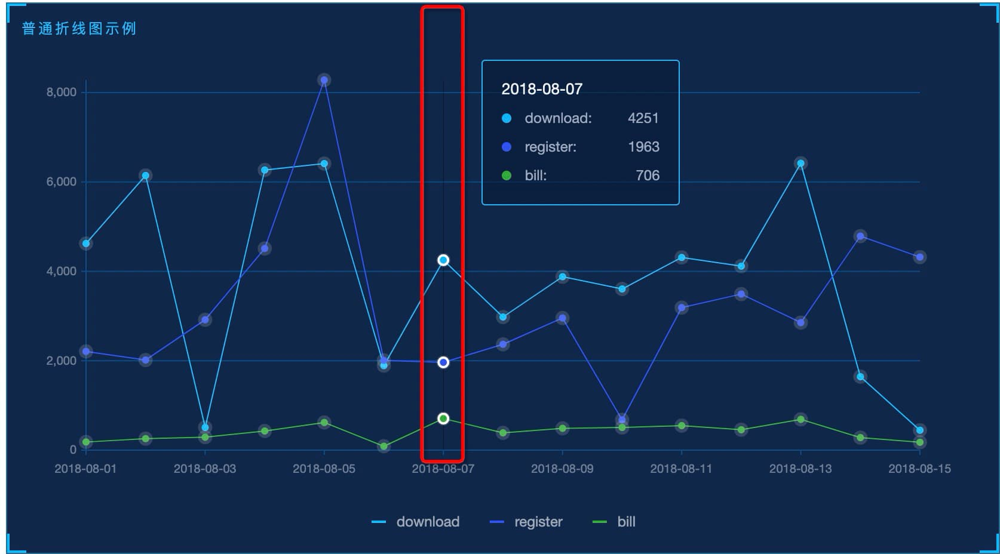

## 效果偏差

### title 标注

因为 G2Plot 的 `title` 属性不支持 `position` 属性到左上角和右下角，所以 y 轴的单位和标注只能自己使用 `description`属性实现，使用方法见 <b>基础配置说明 - yAxis</b>。

### 玫瑰图的 tooltip

- 1.因为使用的是 tooltip.custom.onChange 方法动态修改 tooltip 的内容来达到隐藏假数据的效果的，所以第一次 hover 出现 tooltip 时，假数据会显示出来，已经给 g2plot 提了 issue。目前官网的推荐方法也是这样做的，<a href="https://g2plot.antv.vision/zh/examples/general/tooltip#tooltip-statistic-value">官网例子</a>。

- 2.在 hover 空数据的时候会显示空的 tooltip 框，已经给 g2plot 提了 issue。

### 折线图的背景高亮效果

- 在 G2Plot 目前版本(1.1.2) 中不支持折线图的参考线高亮效果,不支持辅助线配置(最多隐藏)。

### 图例自定义

1.G2Plot 目前版本(1.1.2) 不支持自定义图例样式。

2.G2Plot 目前版本(1.1.2) 不支持过滤图例。
