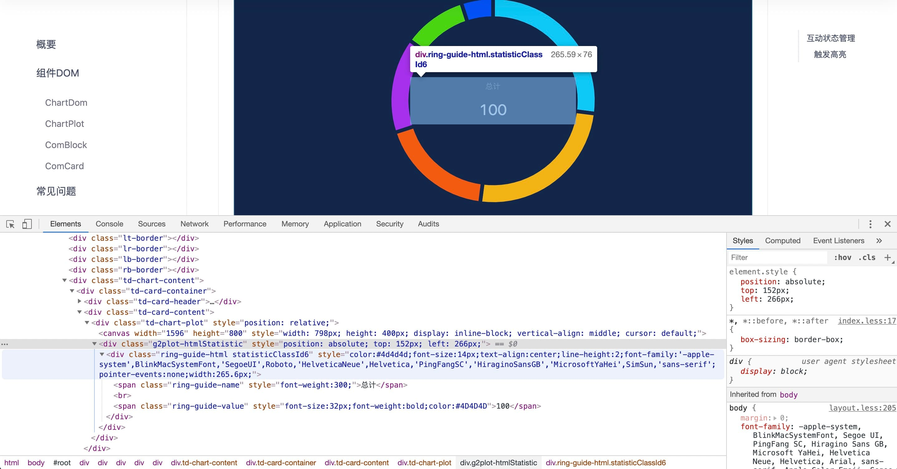
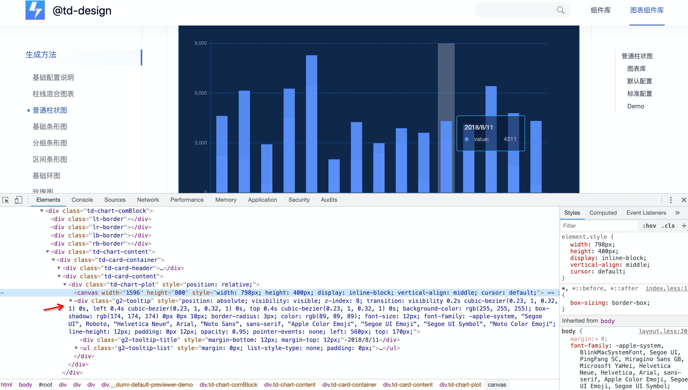

## 样式控制

在 G2Plot 中，不同于 echarts ，有一些元素其实是 DOM 元素，而且有特定的 class，所以可以在项目的 global.less 中全局定义其样式，但是要注意样式的优先级为 `!important` 来覆盖原有样式。

### 指标盘样式控制

比如饼图的中间指标盘就可以在页面中找到，所以可以通过修改 `ring-guide-name` 和 `ring-guide-name` class 的样式来全局修改，

### tooltip 样式控制

`tooltip` 的元素也可以在页面中找到，所以可以通过修改 `g2-tooltip-title` ， `g2-tooltip-name` 和 `g2-tooltip-value` class 的样式来全局修改，

