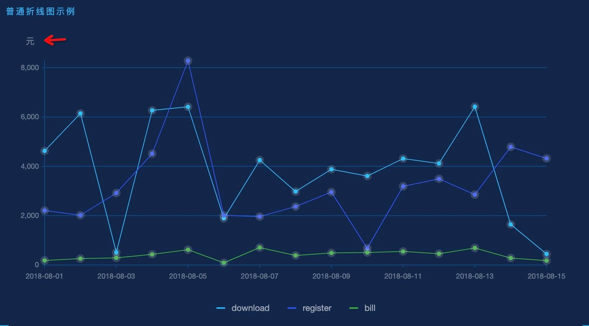

---
group:
  title: 生成方法
---

## 基础配置说明

### 配置说明

- #### 默认配置是指在 `@td-design/charts` 图表组件库中默认设置的值。
- 组件库内部配置：是指在图表组件库中为了满足特定的需求而自定义的配置，偏定制化。
- 标准配置：为 G2Plot 或 G2 官网的图表配置属性，本文档只列举部分常用配置，如果需要详细配置项请访问 <a href="https://g2.antv.vision/zh/examples">G2</a> 或 <a href="https://g2plot.antv.vision/zh/examples/gallery">G2Plot</a> 官网。

### 函数方法说明

&emsp;&emsp;在 ChartPlot 和 ChartDom 属性的 getDom 方法中可使用各种 create 方法，create 方法需要传入参数 { dom, data, config }。

#### 细分配置

| 细分配置 | 功能描述               | 类型                                   | 是否必选 |
| -------- | ---------------------- | -------------------------------------- | -------- |
| dom      | 从函数参数里传入的 dom | HTMLElement                            | true     |
| data     | 图表数据源             | DataItem[]\(混合图表中为 DataItem[][]) | true     |
| config   | 自定义的配置项         | T(由具体图表方法决定)                  | false    |

### 基础公共配置

柱线图 config 中的基础配置项如下：

```js
export const baseConfig = {
  padding: [20, 50, 70, 50],
  // 图表是否自适应容器宽高,当 forceFit 设置为 true 时，width 和 height 的设置将失效。
  forceFit: true,
  // 在公共配置项中有定义
  xAxis: baseXAxis,
  // 在公共配置项中有定义
  yAxis: baseYAxis,
  // 在公共配置项中有定义
  legend: baseLegend,
  responsive: true,
};
```

饼图/环图 config 中的基础配置项如下：

```js
export const basePieConfig = {
  padding: 'auto',
  // 图表是否自适应容器宽高,当 forceFit 设置为 true 时，width 和 height 的设置将失效。
  forceFit: true,
  legend: baseLegend,
  responsive: true,
};
```

柱线图，混合图表 config 中的基础配置如下：

```js
// 折线基础配置-混合图表
export const baseLineConfig = {
  lineSize: 2,
  point: {
    visible: true,
    size: 3,
    color: '#FEB01E',
    style: {
      stroke: '#FEB01E',
      shadowColor: '#FEB01E',
      shadowBlur: 10,
    },
  },
};
// 混合图表Y轴配置
export const baseComboYAxis = {
  ...baseYAxis,
  colorMapping: false,
  label: {
    style: {
      // 隐藏默认填充色
      fillOpacity: 0,
      stroke: 'rgba(255, 255, 255, 0.4)',
    },
  },
  line: {
    visible: true,
    style: {
      stroke: 'rgba(255, 255, 255, 0.4)',
      lineWidth: 1,
    },
  },
  tickLine: {
    visible: false,
  },
};
// 混合图系列-基础配置
export const baseComboConfig = {
  padding: [20, 50, 70, 50],
  forceFit: true,
  xAxis: baseXAxis,
  lineConfig: baseLineConfig,
  yAxis: {
    leftConfig: baseComboYAxis,
    rightConfig: baseComboYAxis,
  },
  legend: baseComboLegend,
  responsive: true,
};
```

### padding

<b>可选</b>，<i>number | number[] | string</i>

#### 功能描述

组件库中默认设置是 以达到居中的效果，如果需要自定义图表的位置需要在 config 中配置 padding。

默认配置:`[20, 50, 70, 50]`

### xAxis

<b>可选</b>，<i>object</i>

#### 功能描述

除饼图外，x 方向上的坐标轴，用于展示 xField 对应的映射信息。

#### 默认配置

```js
export const baseXAxis = {
  line: {
    visible: true,
    style: { lineWidth: 1, stroke: 'rgba(9, 75, 133, 1)' },
  },
  tickLine: {
    visible: true,
    style: { lineWidth: 1, stroke: 'rgba(9, 75, 133, 1)' },
  },
  label: {
    style: {
      fontSize: 10,
      fill: 'rgba(255, 255, 255, 0.4)',
    },
  },
  title: {
    visible: false,
  },
};
```

#### 细分配置

| 细分配置 | 类型    | 功能描述                                                                                                                                                                                                                                                                                                                                                                                                                                                                   |
| -------- | ------- | -------------------------------------------------------------------------------------------------------------------------------------------------------------------------------------------------------------------------------------------------------------------------------------------------------------------------------------------------------------------------------------------------------------------------------------------------------------------------- |
| visible  | boolean | 是否可见                                                                                                                                                                                                                                                                                                                                                                                                                                                                   |
| line     | object  | 坐标轴轴线<br/>- visible:boolean 是否可见<br/>- style：object 轴线样式                                                                                                                                                                                                                                                                                                                                                                                                     |
| grid     | object  | 网格线<br/> - visible: boolean 是否可见<br/> - style：object 网格线样式                                                                                                                                                                                                                                                                                                                                                                                                    |
| label    | object  | 坐标轴标签<br/> - visible: boolean 是否可见<br/> - formatter: function 坐标轴标签格式化<br/> - suffix: string 后缀<br/> - precision：number 标签精度，如配置为 2，则格式化为 2 位小数<br/> - mask: string 为日期文本添加格式化遮罩，当坐标轴 type 为 time 时生效<br/> - offsetX: number 位置在 x 方向上的偏移量<br/> - offsetY：number 位置在 y 方向上的偏移量<br/> - style：object 样式<br/> -autoHide: boolean 是否自动隐藏<br/> - autoRotate: boolean 是否自动旋转<br/> |
| title    | object  | 图表标题，目前 G2Plot 的 title 无法配置 position，只能显示在轴中间，不符合设计规范，不建议使用                                                                                                                                                                                                                                                                                                                                                                             |

### yAxis

<b>可选</b>，<i>object</i>

#### 功能描述

除饼图外，y 方向上的坐标轴，用于展示 yField 对应的映射信息。

#### 默认配置

```js
export const baseYAxis = {
  line: {
    visible: true,
    style: { lineWidth: 1, stroke: 'rgba(9, 75, 133, 1)' },
  },
  tickLine: {
    visible: true,
    style: { lineWidth: 1, stroke: 'rgba(9, 75, 133, 1)' },
  },
  grid: {
    visible: true,
    line: {
      style: { lineWidth: 1, stroke: 'rgba(9, 75, 133, 1)' },
    },
  },
  label: {
    style: {
      fontSize: 10,
      fill: 'rgba(255, 255, 255, 0.4)',
    },
    // 数值格式化为千分位
    formatter: (v: string) =>
      `${v}`.replace(/\d{1,3}(?=(\d{3})+$)/g, s => `${s},`),
  },
  title: {
    visible: false,
  },
};
```

#### 注意事项 📌

如果需要左上角的单位，可以使用 `description` 属性达到单位的效果,例如：

```json
{
  "description": {
    "visible": true,
    "text": "元",
    "style": {
      "fontSize": 12,
      "fill": "rgba(255, 255, 255, 0.4)",
      "textAlign": "right",
      "textBaseline": "bottom"
    },
    "alignTo": "left"
  }
}
```

实现效果如下：



#### 细分配置

| 细分配置 | 类型    | 功能描述                                                                                                                                                                                                                                                                                                                                                                                                                                                                   |
| -------- | ------- | -------------------------------------------------------------------------------------------------------------------------------------------------------------------------------------------------------------------------------------------------------------------------------------------------------------------------------------------------------------------------------------------------------------------------------------------------------------------------- |
| visible  | boolean | 是否可见                                                                                                                                                                                                                                                                                                                                                                                                                                                                   |
| min      | number  | 设置坐标轴最小值                                                                                                                                                                                                                                                                                                                                                                                                                                                           |
| max      | number  | 设置坐标轴最大值                                                                                                                                                                                                                                                                                                                                                                                                                                                           |
| line     | object  | 坐标轴轴线<br/>- visible:boolean 是否可见<br/>- style：object 轴线样式                                                                                                                                                                                                                                                                                                                                                                                                     |
| grid     | object  | 网格线<br/> - visible: boolean 是否可见<br/> - style：object 网格线样式                                                                                                                                                                                                                                                                                                                                                                                                    |
| label    | object  | 坐标轴标签<br/> - visible: boolean 是否可见<br/> - formatter: function 坐标轴标签格式化<br/> - suffix: string 后缀<br/> - precision：number 标签精度，如配置为 2，则格式化为 2 位小数<br/> - mask: string 为日期文本添加格式化遮罩，当坐标轴 type 为 time 时生效<br/> - offsetX: number 位置在 x 方向上的偏移量<br/> - offsetY：number 位置在 y 方向上的偏移量<br/> - style：object 样式<br/> -autoHide: boolean 是否自动隐藏<br/> - autoRotate: boolean 是否自动旋转<br/> |
| title    | object  | 图表标题，目前 G2Plot 的 title 无法配置 position，只能显示在轴中间，不符合设计规范，不建议使用                                                                                                                                                                                                                                                                                                                                                                             |

### legend

<b>可选</b>，<i>object</i>

#### 功能描述

图例，多例时展示，用于展示颜色分类信息。

#### 默认配置

```js
export const baseLegend = {
  position: 'bottom-center',
  text: {
    style: {
      fill: 'rgba(255, 255, 255, 0.6)',
    },
  },
};
```

#### 细分配置

| 细分配置 | 类型    | 功能描述                                                                                                                                                                                        |
| -------- | ------- | ----------------------------------------------------------------------------------------------------------------------------------------------------------------------------------------------- |
| visible  | boolean | 是否可见                                                                                                                                                                                        |
| position | string  | 位置，支持 12 方位布局<br/>top-left, top-center,top-right<br/>bottom-left,bottom-center,bottom-right<br/>left-top,left-center,left-bottom<br/>right-top,right-center,right-bottom               |
| text     | object  | 图例文本 <br/> - style: object 配置图例文本样式 <br/> - formatter:(text,cfg)=>string 格式化图例文本                                                                                             |
| marker   | object  | 图例 marker <br/> - symbol: string marker 符号，默认为 'circle'。可选类型： <br/> circle,square 等 <br/> - style: object marker 样式，其中 r 配置 marker 的大小，其余样式参数参考绘图属性文档。 |

### tooltip

<b>可选</b>，<i>object</i>

#### 功能描述

信息提示框

#### 默认配置

```json
{
  "visible": true,
  "offset": 20
}
```

#### 细分配置

| 细分配置  | 类型    | 功能描述                                                                                    |
| --------- | ------- | ------------------------------------------------------------------------------------------- |
| visible   | boolean | 是否可见                                                                                    |
| offset    | number  | 距离鼠标位置偏移值                                                                          |
| domStyles | object  | 配置 tooltip 样式                                                                           |
| formatter | object  | 对 tooltip items 进行格式化，入参为 tooltip fields 对应数值，出参为格式为{name:'a',value:1} |
